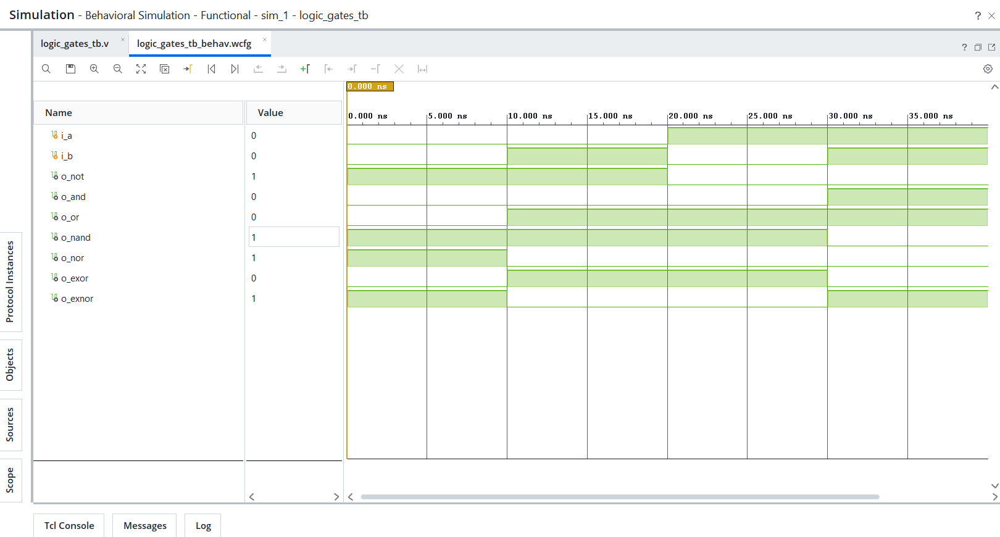

# Day 01 - Logic Gates

## Description
Implemented basic combinational logic gates in Verilog HDL.

## Modules Implemented
- AND Gate
- OR Gate
- NOT Gate
- NAND Gate
- NOR Gate
- EXOR Gate
- EXNOR Gate

## Files
- and_gate.v
- or_gate.v
- not_gate.v
- nand_gate.v
- nor_gate.v
- exor_gate.v
- exnor_gate.v
- logic_gates_tb.v
- waveform.png

## Tools Used
- VS Code
- AMD Vivado 2025.2

## Simulation Result
Behavioral simulation completed successfully.

