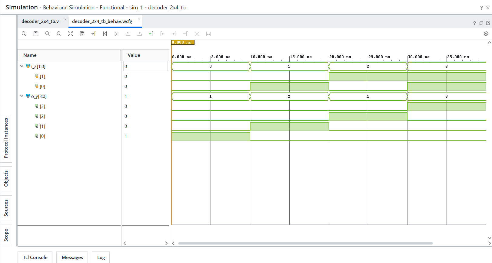
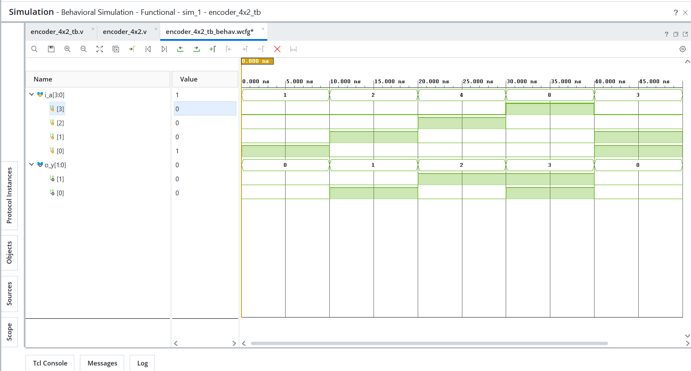
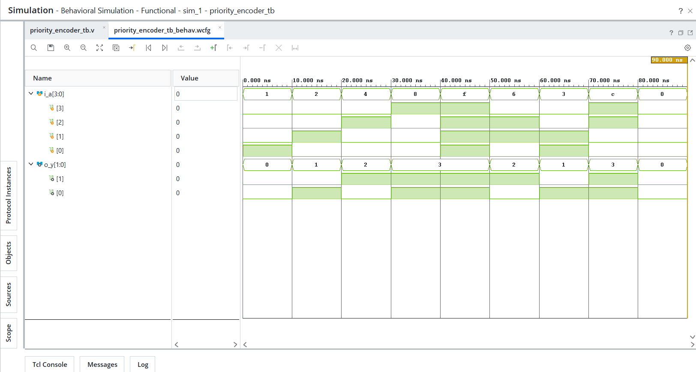

# Day 03 - Decoders and Encoders

## Overview
Implemented decoder and encoder circuits in Verilog HDL.

Decoders and encoders are essential combinational logic circuits widely used in digital systems for signal selection, encoding, and priority-based decision making.

---

## Implemented Modules

### 1. 2:4 Decoder
- Converts 2-bit binary input into one-hot 4-bit output.
- Exhaustive verification performed (all 4 combinations).

### 2. 4:2 Encoder
- Converts one-hot 4-bit input into 2-bit binary output.
- Functional verification performed with valid and invalid input cases.

### 3. 4:2 Priority Encoder
- Resolves multiple active inputs using priority logic.
- Functional verification performed for single, multiple, and no active input cases.

---

## Files Included

```text
decoder_2x4.v
decoder_2x4_tb.v
encoder_4x2.v
encoder_4x2_tb.v
priority_encoder.v
priority_encoder_tb.v
decoder_2x4_waveform.png
encoder_4x2_waveform.png
priority_encoder_waveform.png
README.md
```

---

## Waveforms

### 2:4 Decoder


### 4:2 Encoder


### 4:2 Priority Encoder
