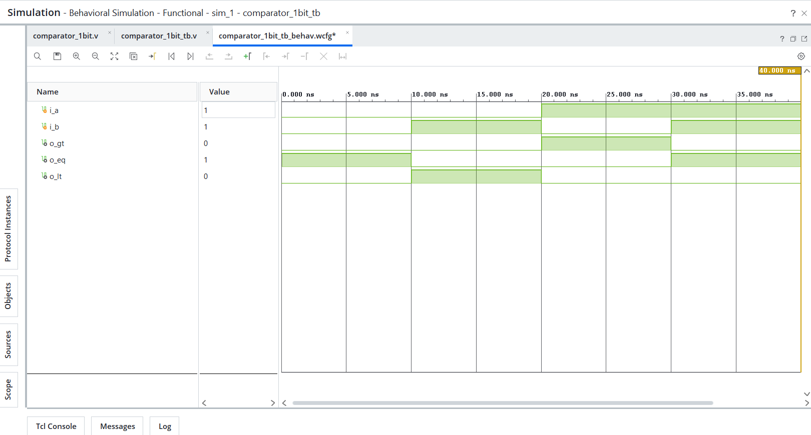
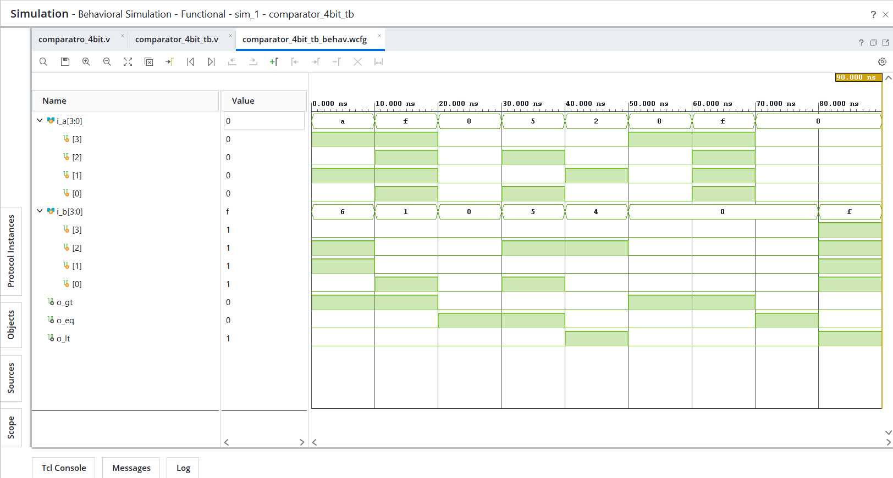

# Day 04 - Comparators

## Overview
This project implements comparator designs in Verilog HDL.

Comparators are fundamental combinational logic blocks widely used in digital systems for decision making, magnitude comparison, and control logic operations.

---

## Implemented Modules

### 1. 1-bit Comparator
- Compares two 1-bit inputs.
- Generates greater than, equal to, and less than outputs.
- Exhaustive verification performed (all 4 combinations).

### 2. 4-bit Comparator
- Compares two 4-bit binary inputs.
- Generates greater than, equal to, and less than outputs.
- Functional verification performed using equality, greater than, less than, and boundary test cases.

---

## Files Included

```text
comparator_1bit.v
comparator_1bit_tb.v
comparator_4bit.v
comparator_4bit_tb.v
comparator_1bit_waveform.png
comparator_4bit_waveform.png
README.md
```

---

## Waveforms

### 1-bit Comparator


### 4-bit Comparator
