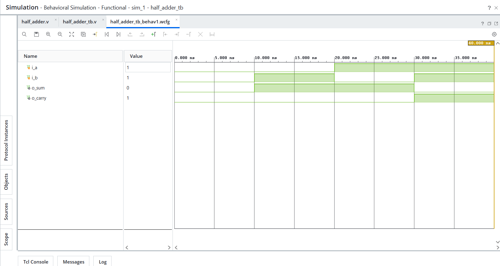
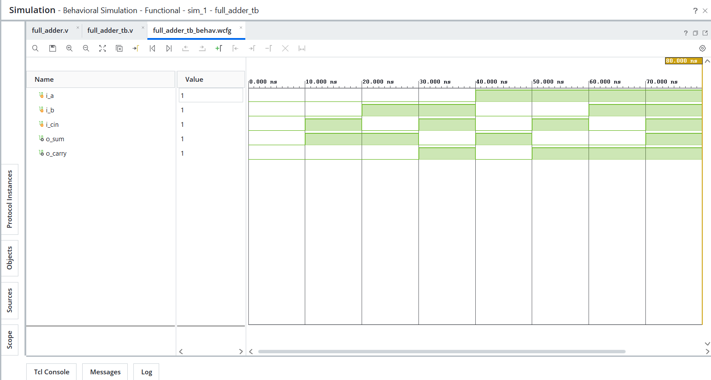
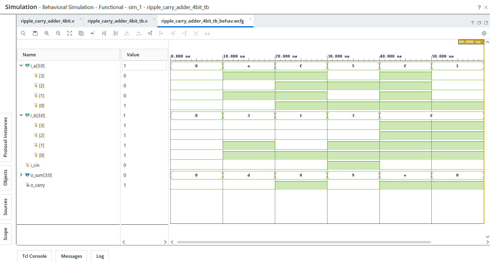

# Day 05 - Adders

## Overview
This project implements adder designs in Verilog HDL.

Adders are fundamental arithmetic building blocks widely used in digital systems for binary addition, address calculation, arithmetic logic operations, and datapath design.

---

## Implemented Modules

### 1. Half Adder
- Performs addition of two 1-bit inputs.
- Generates sum and carry outputs.
- Exhaustive verification performed (all 4 combinations).

### 2. Full Adder
- Performs addition of two 1-bit inputs with carry-in.
- Implemented structurally using two half adders.
- Generates sum and carry-out outputs.
- Exhaustive verification performed (all 8 combinations).

### 3. 4-bit Ripple Carry Adder
- Performs 4-bit binary addition with carry-in support.
- Implemented structurally using four full adders.
- Demonstrates hierarchical RTL design and carry propagation.
- Functional verification performed using normal, carry generation, carry-in, and boundary test cases.

---

## Files Included

```text
half_adder.v
half_adder_tb.v
full_adder.v
full_adder_tb.v
ripple_carry_adder_4bit.v
ripple_carry_adder_4bit_tb.v
half_adder_waveform.png
full_adder_waveform.png
ripple_carry_adder_4bit_waveform.png
README.md
```

---

## Waveforms

### Half Adder


### Full Adder


### 4-bit Ripple Carry Adder
