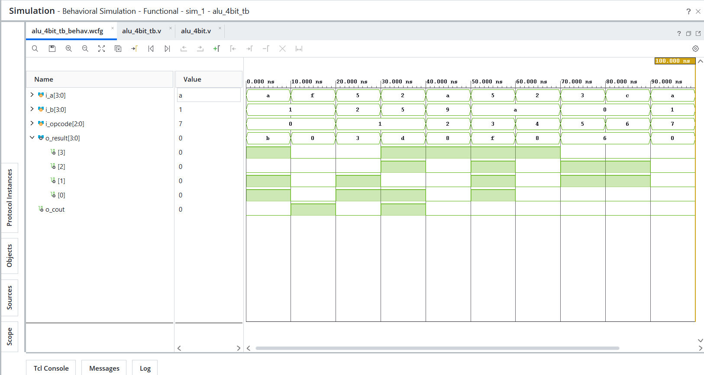

# Day 07 - ALU

## Overview
This project implements a 4-bit Arithmetic Logic Unit (ALU) in Verilog HDL.

ALUs are fundamental datapath components widely used in processors and digital systems for arithmetic operations, logical operations, and bit manipulation.

---

## Implemented Module

### 1. 4-bit ALU
- Performs arithmetic, logical, and shift operations using opcode-based control.
- Implemented using combinational RTL with `always @(*)` and `case` statement.
- Demonstrates arithmetic operation selection and control logic design.
- Functional verification performed using targeted opcode-based test cases.

---

## Supported Operations

| Opcode | Operation |
|--------|-----------|
| 000 | ADD |
| 001 | SUB |
| 010 | AND |
| 011 | OR |
| 100 | XOR |
| 101 | Shift Left |
| 110 | Shift Right |
| 111 | Default / Safe Output |

---

## Files Included

```text
alu_4bit.v
alu_4bit_tb.v
alu_4bit_waveform.png
README.md
```

---

## Waveform

### 4-bit ALU
