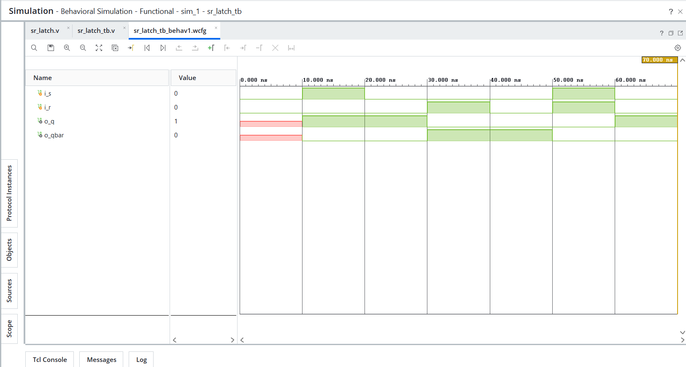
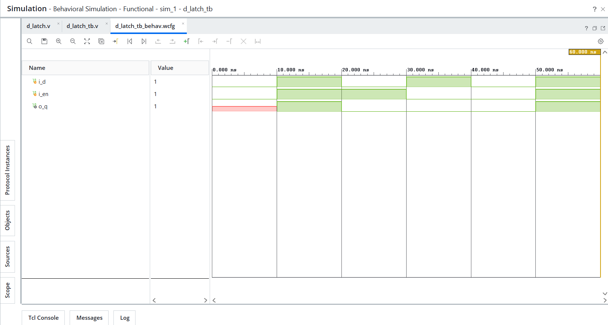
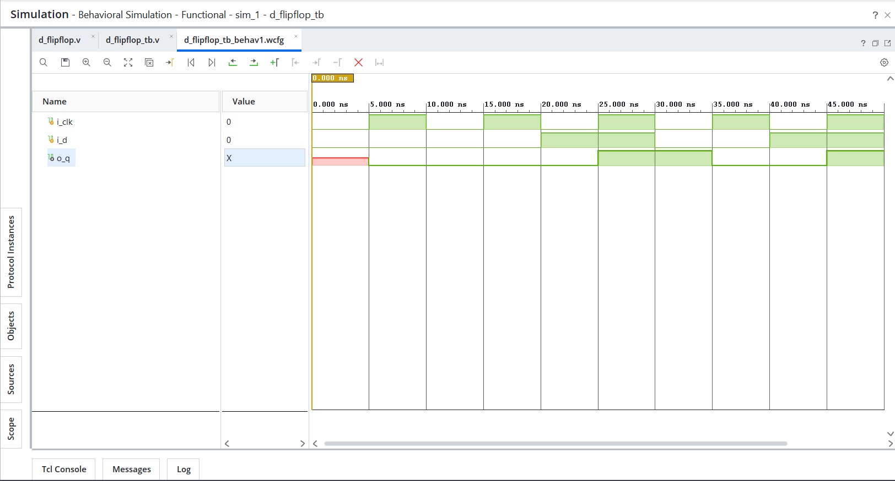
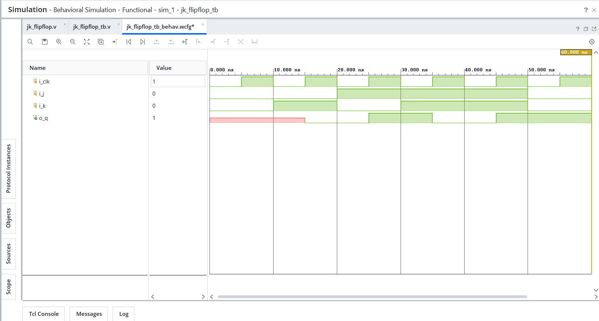
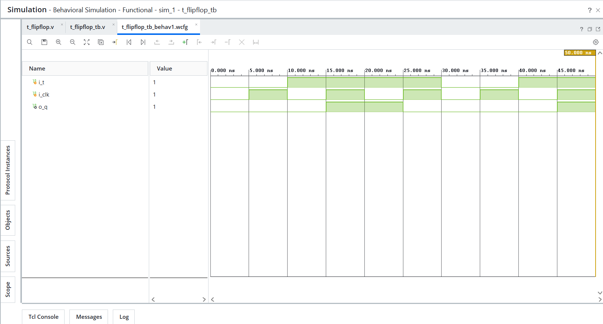

# Day 08 - Latches and Flip-Flops

## Overview
This project implements fundamental sequential logic building blocks in Verilog HDL.

Unlike combinational circuits, sequential circuits store previous state and update outputs based on current inputs and stored state. Latches and flip-flops are core memory elements widely used in digital systems, registers, counters, finite state machines, and processor datapaths.

---

## Implemented Modules

### 1. SR Latch
- Implemented using cross-coupled NOR gate logic.
- Demonstrates basic memory behavior using feedback.
- Supports set, reset, hold, and invalid state conditions.

---

### 2. D Latch
- Level-sensitive storage element.
- Transparent when enable is high.
- Holds previous state when enable is low.
- Demonstrates latch inference using behavioral RTL.

---

### 3. D Flip-Flop
- Positive edge-triggered storage element.
- Captures input data only on the rising edge of the clock.
- Demonstrates synchronous sequential RTL design.

---

### 4. JK Flip-Flop
- Positive edge-triggered flip-flop with set, reset, hold, and toggle operations.
- Demonstrates state-dependent sequential behavior.

JK behavior:
- `J=0, K=0` → Hold
- `J=0, K=1` → Reset
- `J=1, K=0` → Set
- `J=1, K=1` → Toggle

---

### 5. T Flip-Flop
- Positive edge-triggered toggle flip-flop.
- Holds state when `T=0`.
- Toggles output when `T=1`.
- Commonly used in counters and frequency division circuits.

---

## Files Included

```text
sr_latch.v
sr_latch_tb.v
sr_latch_waveform.png

d_latch.v
d_latch_tb.v
d_latch_waveform.png

d_flipflop.v
d_flipflop_tb.v
d_flipflop_waveform.png

jk_flipflop.v
jk_flipflop_tb.v
jk_flipflop_waveform.png

t_flipflop.v
t_flipflop_tb.v
t_flipflop_waveform.png

README.md
```

---

## Waveforms

### SR Latch


### D Latch


### D Flip-Flop


### JK Flip-Flop


### T Flip-Flop
