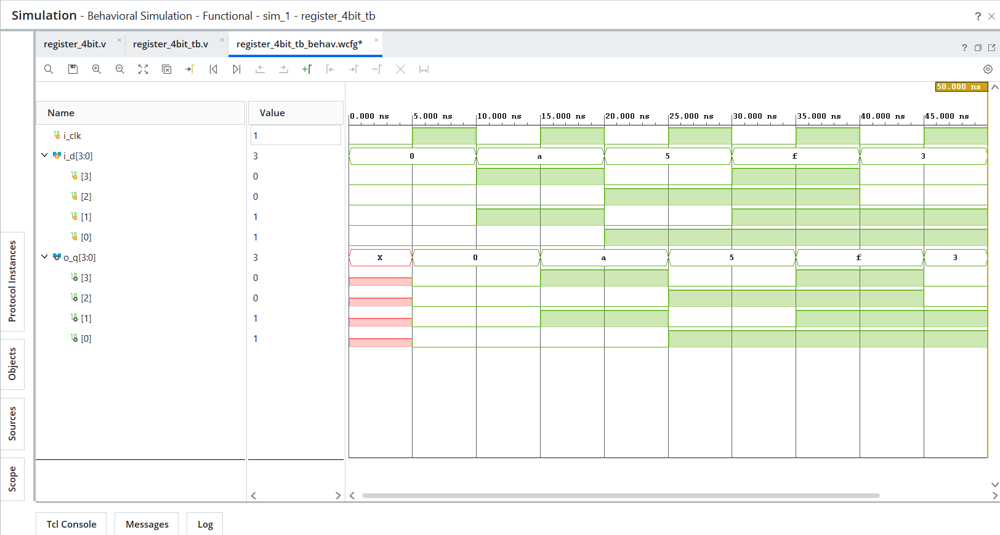
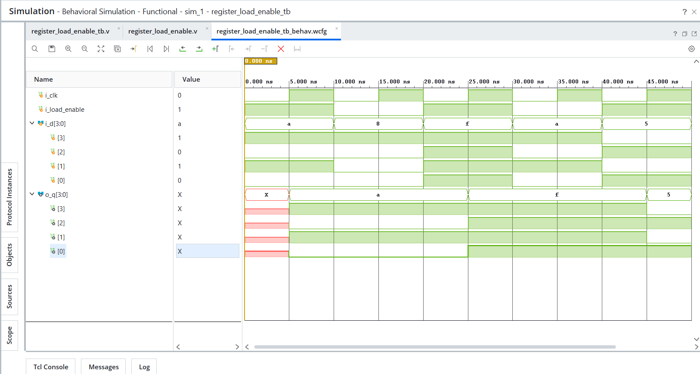
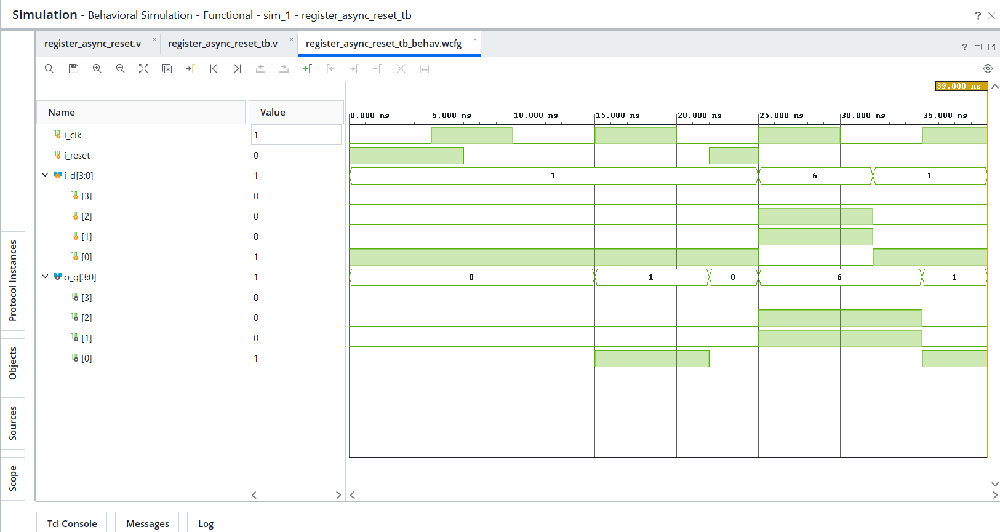

# Day 09 - Registers

## Overview
This project implements fundamental register-based sequential logic circuits in Verilog HDL.

Registers are essential storage elements in digital systems and are widely used in processors, datapaths, counters, finite state machines, and pipeline architectures.

This day focuses on synchronous data storage, load enable behavior, and asynchronous reset functionality.

---

## Implemented Modules

### 1. 4-bit Register
- Basic synchronous 4-bit register
- Captures input data on the positive edge of the clock

Behavior:
- On `posedge i_clk` → `o_q <= i_d`

---

### 2. Register with Load Enable
- 4-bit register with conditional data loading
- Loads input data only when load enable is active
- Holds previous value when load enable is inactive

Behavior:
- `i_load_enable = 1` → Load input data
- `i_load_enable = 0` → Hold previous value

---

### 3. Register with Asynchronous Reset
- 4-bit register with asynchronous reset
- Reset clears output immediately without waiting for clock edge

Behavior:
- `i_reset = 1` → Clear output to `0000`
- `i_reset = 0` → Normal register operation

---

## Files Included

```text
register_4bit.v
register_4bit_tb.v
register_load_enable.v
register_load_enable_tb.v
register_async_reset.v
register_async_reset_tb.v

register_4bit_waveform.png
register_load_enable_waveform.png
register_async_reset_waveform.png

README.md
```

---

## Waveforms

### 4-bit Register


### Register with Load Enable


### Register with Asynchronous Reset
