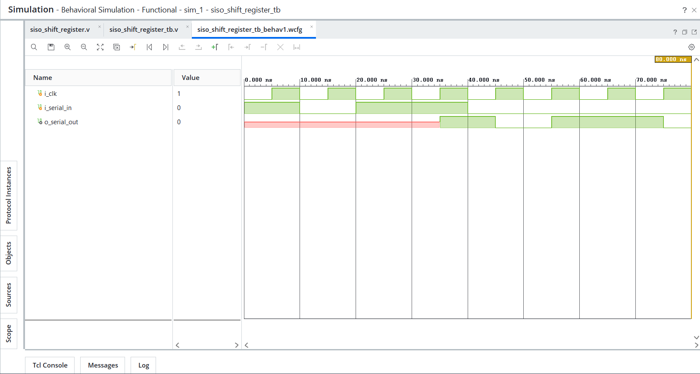
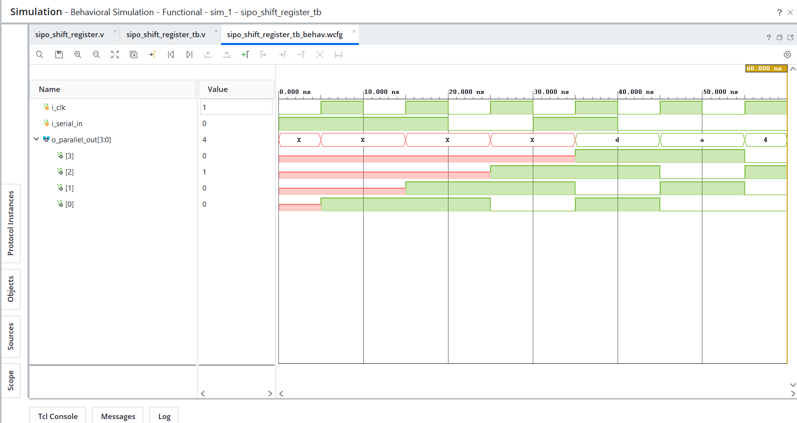
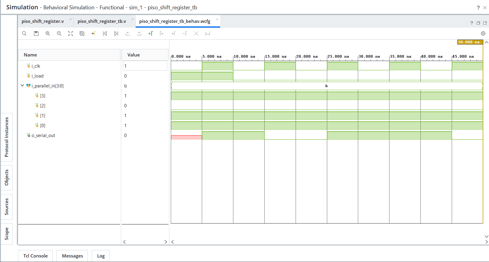
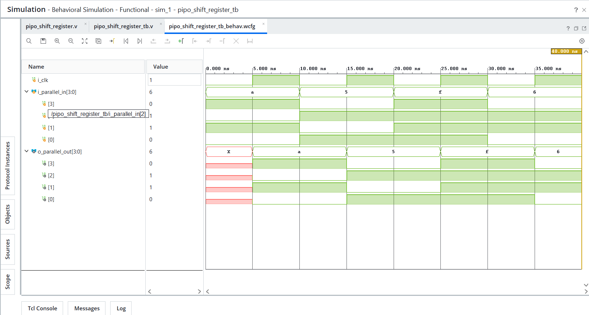

# Day 10 - Shift Registers

## Overview
This project implements shift register designs in Verilog HDL.

Shift registers are sequential logic circuits used to store and move data between flip-flops with each clock pulse. They are widely used in serial communication, data transfer, buffering, serializers, deserializers, and digital communication systems.

---

## Implemented Modules

### 1. SISO Shift Register
- Serial In Serial Out shift register
- Accepts 1-bit serial input
- Outputs data serially after shifting through the register

Behavior:
- On `posedge i_clk` → shift input bit into register
- Oldest bit appears at serial output

---

### 2. SIPO Shift Register
- Serial In Parallel Out shift register
- Accepts serial input data
- Makes full register contents available as parallel output

Behavior:
- On `posedge i_clk` → shift input bit into register
- Output reflects full register contents

---

### 3. PISO Shift Register
- Parallel In Serial Out shift register
- Loads 4-bit parallel data
- Shifts data out serially

Behavior:
- `i_load = 1` → Load parallel input data
- `i_load = 0` → Shift data serially

---

### 4. PIPO Shift Register
- Parallel In Parallel Out register
- Loads parallel input data
- Provides parallel output

Behavior:
- On `posedge i_clk` → `o_parallel_out <= i_parallel_in`

---

## Files Included

```text
siso_shift_register.v
siso_shift_register_tb.v
sipo_shift_register.v
sipo_shift_register_tb.v
piso_shift_register.v
piso_shift_register_tb.v
pipo_shift_register.v
pipo_shift_register_tb.v

siso_shift_register_waveform.png
sipo_shift_register_waveform.png
piso_shift_register_waveform.png
pipo_shift_register_waveform.png

README.md
```

---

## Waveforms

### SISO Shift Register


### SIPO Shift Register


### PISO Shift Register


### PIPO Shift Register
