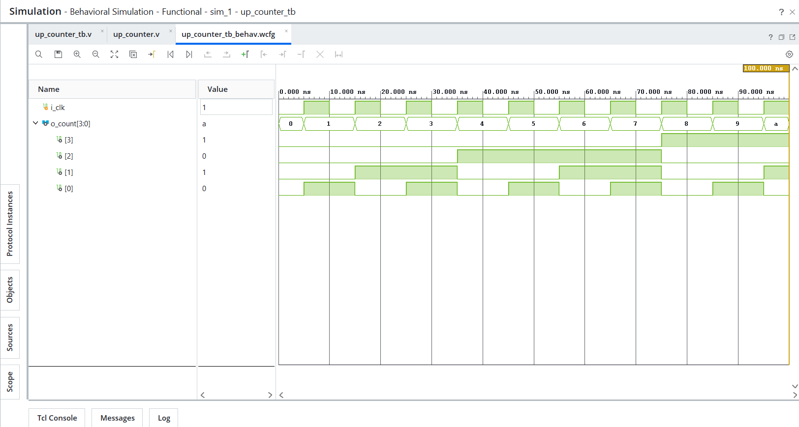
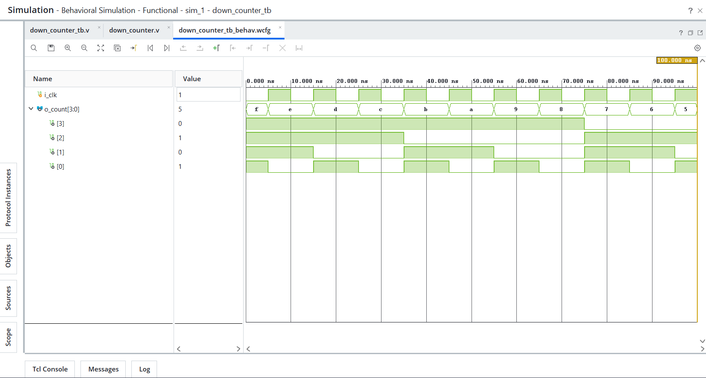
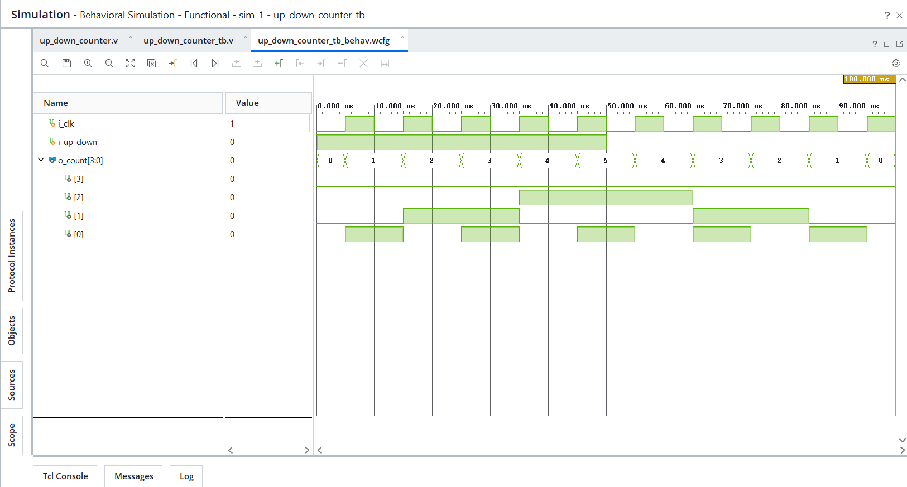

# Day 11 - Counters

## Overview
This project implements counter designs in Verilog HDL.

Counters are essential sequential circuits used in digital systems for timing, control, state tracking, address generation, and protocol operation.

This day focuses on automatic state progression, counting logic, directional counting, and control-driven sequential behavior.

---

## Implemented Modules

### 1. Up Counter
- Basic 4-bit synchronous up counter
- Increments output value on every positive clock edge

Behavior:
- On `posedge i_clk` → `o_count <= o_count + 1`

Sequence:
```text
0 → 1 → 2 → 3 → 4 ...
```

---

### 2. Down Counter
- Basic 4-bit synchronous down counter
- Decrements output value on every positive clock edge

Behavior:
- On `posedge i_clk` → `o_count <= o_count - 1`

Sequence:
```text
15 → 14 → 13 → 12 → 11 ...
```

---

### 3. Up/Down Counter
- 4-bit synchronous bidirectional counter
- Counts upward or downward based on control input

Behavior:
- `i_up_down = 1` → Count up
- `i_up_down = 0` → Count down

Sequence:
```text
0 → 1 → 2 → 3 → 4
4 → 3 → 2 → 1 → 0
```

---

## Files Included

```text
up_counter.v
up_counter_tb.v
down_counter.v
down_counter_tb.v
up_down_counter.v
up_down_counter_tb.v

up_counter_waveform.png
down_counter_waveform.png
up_down_counter_waveform.png

README.md
```

---

## Waveforms

### Up Counter


### Down Counter


### Up/Down Counter
