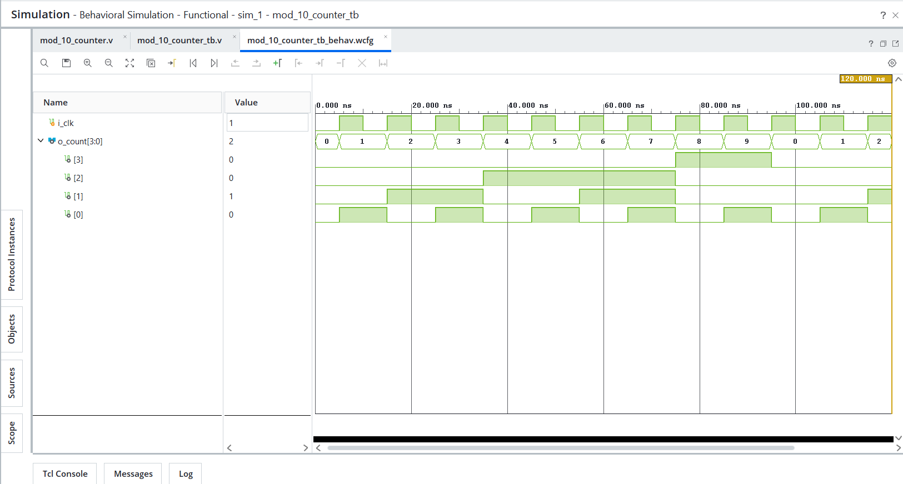
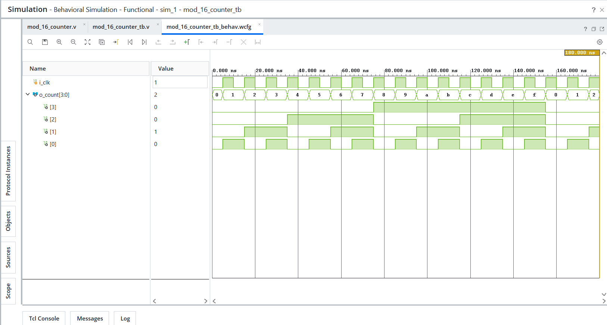

# Day 12 - Mod Counters

## Overview
This project implements mod counter designs in Verilog HDL.

Modulo counters are sequential circuits that count within a fixed range and reset back to the initial state after reaching a terminal count value. These counters are widely used in digital clocks, timers, frequency division circuits, and protocol timing systems.

---

## Implemented Modules

### 1. Mod-10 Counter
- 4-bit modulo-10 counter
- Counts from 0 to 9
- Resets back to 0 after reaching 9
- Demonstrates terminal count detection logic

Sequence:
```text
0 → 1 → 2 → 3 → 4 → 5 → 6 → 7 → 8 → 9 → 0
```

---

### 2. Mod-16 Counter
- 4-bit modulo-16 counter
- Counts from 0 to 15
- Resets back to 0 after reaching 15
- Demonstrates modulo counting using 4-bit sequential logic

Sequence:
```text
0 → 1 → 2 → ... → 14 → 15 → 0
```

---

## Files Included

```text
mod_10_counter.v
mod_10_counter_tb.v

mod_16_counter.v
mod_16_counter_tb.v

mod_10_counter_waveform.png
mod_16_counter_waveform.png

README.md
```

---

## Waveforms

### Mod-10 Counter


### Mod-16 Counter
