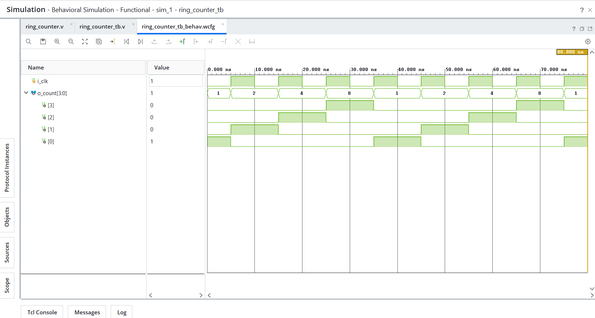
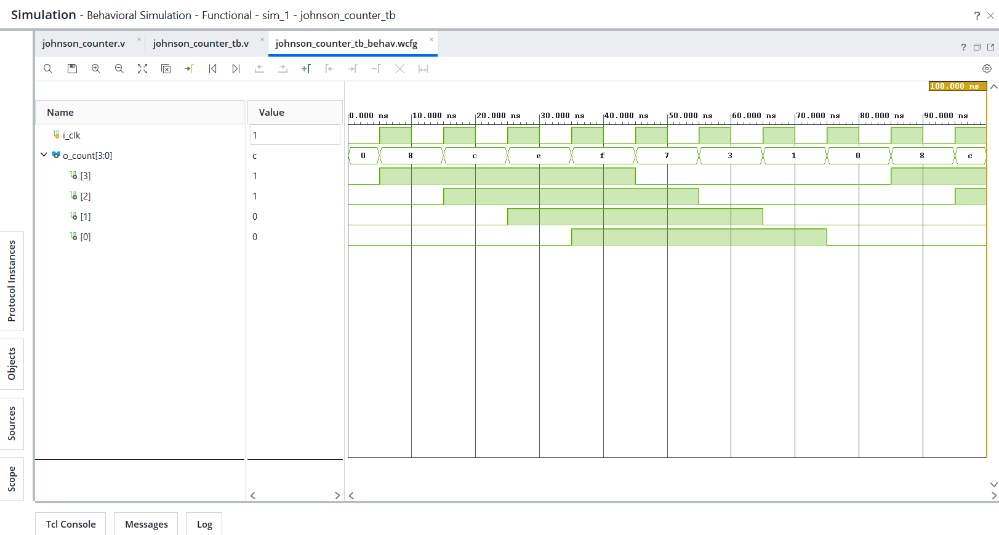

# Day 13 - Ring Counter and Johnson Counter

## Overview
This project implements ring counter and Johnson counter designs in Verilog HDL.

Ring counters and Johnson counters are sequential circuits based on shift register architectures with feedback connections. These counters are widely used in digital sequencing, finite state machines, pattern generation, timing control, and scan-based applications.

---

## Implemented Modules

### 1. Ring Counter
- 4-bit ring counter using circular feedback
- Performs circular bit shifting operation
- Only one bit remains HIGH at a time
- Demonstrates one-hot sequence generation

Sequence:
```text
0001 → 0010 → 0100 → 1000 → 0001
```

---

### 2. Johnson Counter
- 4-bit Johnson counter using inverted feedback
- Performs twisted ring shifting operation
- Generates 2N unique states using N flip-flops
- Demonstrates sequential pattern generation

Sequence:
```text
0000 → 1000 → 1100 → 1110 → 1111 → 0111 → 0011 → 0001 → 0000
```

---

## Files Included

```text
ring_counter.v
ring_counter_tb.v

johnson_counter.v
johnson_counter_tb.v

ring_counter_waveform.png
johnson_counter_waveform.png

README.md
```

---

## Waveforms

### Ring Counter


### Johnson Counter
