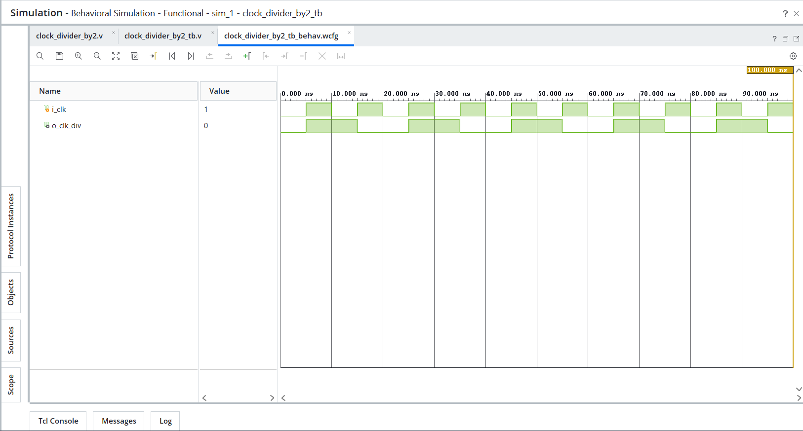
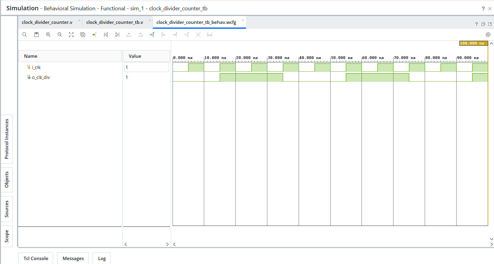

# Day 14 - Clock Divider

## Overview
This project implements clock divider designs in Verilog HDL.

Clock dividers are sequential circuits that generate lower-frequency clocks from a higher-frequency input clock. They are widely used in digital systems for timing generation, baud rate generation, timers, counters, PWM circuits, and communication protocols.

---

## Implemented Modules

### 1. Divide-by-2 Clock Divider
- Basic clock divider using toggle operation
- Output clock toggles on every positive edge of the input clock
- Generates an output frequency equal to half of the input frequency
- Demonstrates fundamental clock division concept

Behavior:
```text
Input Frequency  = Fin
Output Frequency = Fin / 2
```

---

### 2. Counter-Based Clock Divider
- Clock divider implemented using a counter
- Uses terminal count detection to control output clock toggling
- Demonstrates counter-driven timing generation
- Introduces the concept of divide-by-N clock generation

Behavior:
```text
Counter counts clock cycles
↓
Terminal count reached
↓
Output clock toggles
↓
Counter resets
```

For the implemented design:

```text
Input Frequency  = Fin
Output Frequency = Fin / 4
```

---

## Files Included

```text
clock_divider_by2.v
clock_divider_by2_tb.v

clock_divider_counter.v
clock_divider_counter_tb.v

clock_divider_by2_waveform.png
clock_divider_counter_waveform.png

README.md
```

---

## Waveforms

### Divide-by-2 Clock Divider


### Counter-Based Clock Divider
