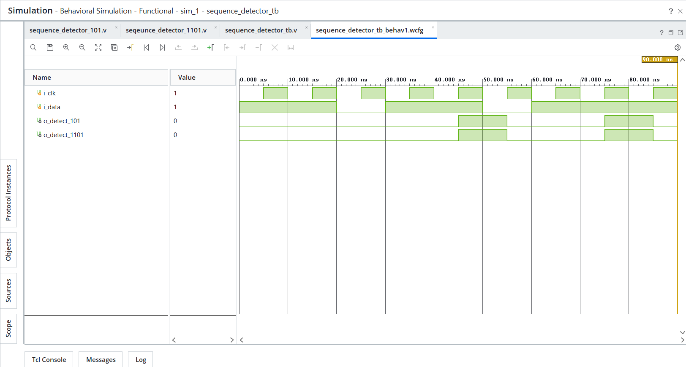

# Day 15 - Sequence Detectors

## Overview
This project implements sequence detector designs in Verilog HDL.

Sequence detectors are sequential circuits used to identify specific bit patterns in a serial data stream. These designs are commonly used in communication systems, protocol controllers, pattern recognition circuits, and digital control applications.

---

## Implemented Modules

### 1. Sequence Detector (101)
- Moore FSM-based sequence detector
- Detects the bit pattern `101`
- Generates a detection pulse when the sequence is recognized
- Supports overlapping sequence detection

Sequence:
```text
101
```

---

### 2. Sequence Detector (1101)
- Moore FSM-based sequence detector
- Detects the bit pattern `1101`
- Generates a detection pulse when the sequence is recognized
- Supports overlapping sequence detection

Sequence:
```text
1101
```

---

## Files Included

```text
sequence_detector_101.v
sequence_detector_1101.v

sequence_detector_tb.v

sequence_detector_waveform.png

README.md
```

---

## Waveforms

### Sequence Detectors
