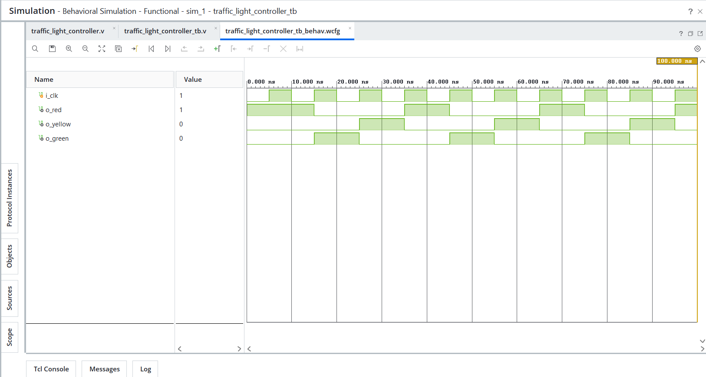

# Day 16 - Traffic Light Controller

## Overview

This project implements a traffic light controller in Verilog HDL.

Traffic light controllers are sequential circuits that use Finite State Machines (FSMs) to control signal transitions in a predefined order. They are commonly used in traffic management systems and serve as a practical example of FSM-based design.

---

## Implemented Modules

### 1. Traffic Light Controller

- Moore FSM-based design
- Controls Red, Yellow, and Green lights
- Changes state on every positive clock edge
- Cyclic state transitions

State sequence:

```text
RED → GREEN → YELLOW → RED
```

Output states:

| State  | Red | Yellow | Green |
|---------|-----|--------|--------|
| RED     | 1   | 0      | 0      |
| GREEN   | 0   | 0      | 1      |
| YELLOW  | 0   | 1      | 0      |

---

## Files Included

```text
traffic_light_controller.v

traffic_light_controller_tb.v

traffic_light_controller_waveform.png

README.md
```

---

## Waveforms

### Traffic Light Controller

