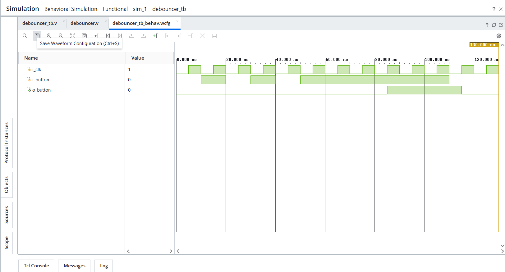

# Day 17 - Debouncer

## Overview

This project implements a debouncer in Verilog HDL.

Debouncers are sequential circuits used to eliminate unwanted signal transitions caused by mechanical switch bouncing. They ensure that a button press is recognized only after the input remains stable for a specified period of time.

---

## Implemented Modules

### 1. Debouncer

- Counter-based debouncer design
- Filters mechanical button bounce
- Requires the input to remain stable for multiple clock cycles before asserting the output
- Prevents false button press detections
- Resets automatically when the button is released

Operation:

```text
Button Bounce:
1 → 0 → 1 → 0 → 1

Output:
0
```

```text
Stable Button Press:
1 → 1 → 1 → 1 → 1

Output:
1
```

---

## Files Included

```text
debouncer.v

debouncer_tb.v

debouncer_waveform.png

README.md
```

---

## Waveforms

### Debouncer

