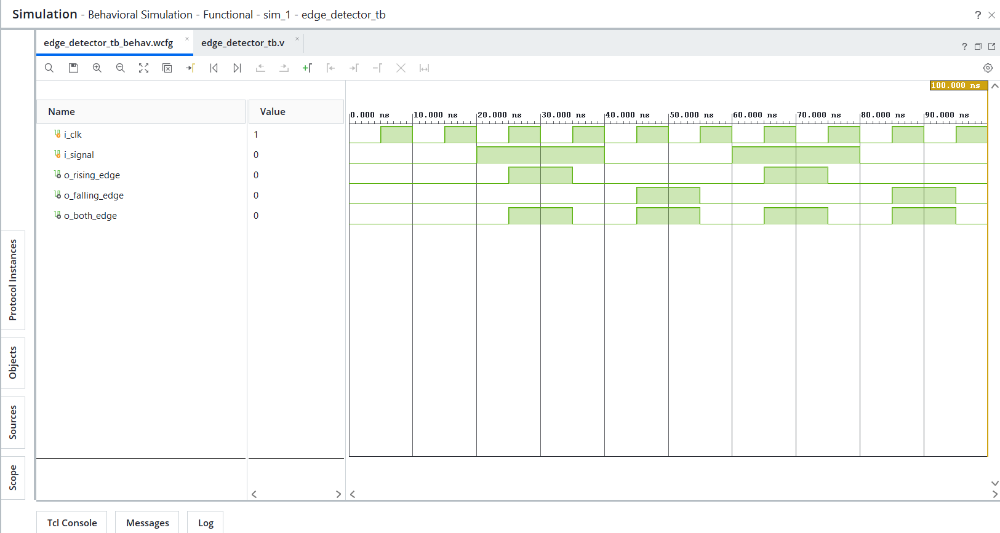

# Day 18 - Edge Detectors

## Overview

This project implements edge detector designs in Verilog HDL.

Edge detectors are sequential circuits used to identify transitions in digital signals. They are widely used in event detection, interrupt generation, pulse generation, control systems, and digital communication interfaces.

---

## Implemented Modules

### 1. Rising Edge Detector

- Detects a low-to-high transition (`0 → 1`)
- Generates a single-clock pulse when a rising edge occurs
- Uses previous-state storage for comparison

Transition:

```text
0 → 1
```

---

### 2. Falling Edge Detector

- Detects a high-to-low transition (`1 → 0`)
- Generates a single-clock pulse when a falling edge occurs
- Uses previous-state storage for comparison

Transition:

```text
1 → 0
```

---

### 3. Both Edge Detector

- Detects both rising and falling edges
- Generates a single-clock pulse whenever a transition occurs
- Uses XOR-based edge detection

Transitions:

```text
0 → 1
1 → 0
```

---

## Files Included

```text
rising_edge_detector.v
falling_edge_detector.v
both_edge_detector.v

edge_detector_tb.v

edge_detector_waveform.png

README.md
```

---

## Waveforms

### Edge Detectors

