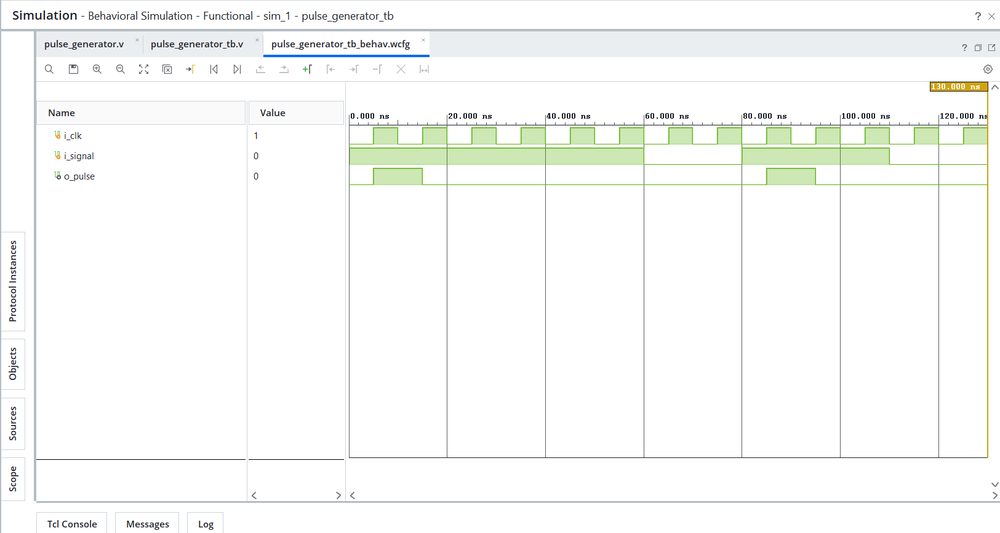

# Day 19 - Pulse Generator

## Overview

This project implements a pulse generator in Verilog HDL.

Pulse generators are sequential circuits used to generate a single-clock-cycle pulse when an input event occurs. They are commonly used in control logic, event detection, interrupt generation, counters, and finite state machine triggering applications.

---

## Implemented Modules

### 1. Pulse Generator

- Generates a single-clock-cycle pulse
- Detects a rising edge on the input signal
- Produces a pulse regardless of how long the input remains HIGH
- Uses previous-state storage for edge detection

Operation:

```text
Input:
0 → 1

Output:
Pulse
```

Example:

```text
Input:
0 0 1 1 1 1 0 0

Output:
0 0 1 0 0 0 0 0
```

---

## Files Included

```text
pulse_generator.v

pulse_generator_tb.v

pulse_generator_waveform.png

README.md
```

---

## Waveforms

### Pulse Generator

