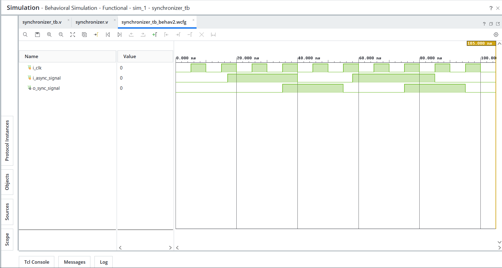

# Day 20 - Synchronizer

## Overview

This project implements a 2 Flip-Flop Synchronizer in Verilog HDL.

Synchronizers are widely used in digital systems to safely transfer single-bit signals from one clock domain to another. They help reduce the risk of metastability caused by asynchronous inputs and are one of the most common Clock Domain Crossing (CDC) techniques used in FPGA and ASIC designs.

---

## Implemented Modules

### 1. Two Flip-Flop Synchronizer

- Uses two cascaded flip-flops
- Synchronizes an asynchronous input signal to the local clock domain
- Helps reduce metastability effects
- Introduces a small synchronization delay
- Commonly used for single-bit CDC signals

Operation:

```text
Asynchronous Input
        │
        ▼
+-------------+
| Flip-Flop 1 |
+-------------+
        │
        ▼
+-------------+
| Flip-Flop 2 |
+-------------+
        │
        ▼
Synchronized Output
```

---

## Files Included

```text
synchronizer.v

synchronizer_tb.v

synchronizer_waveform.png

README.md
```

---

## Waveforms

### Two Flip-Flop Synchronizer

