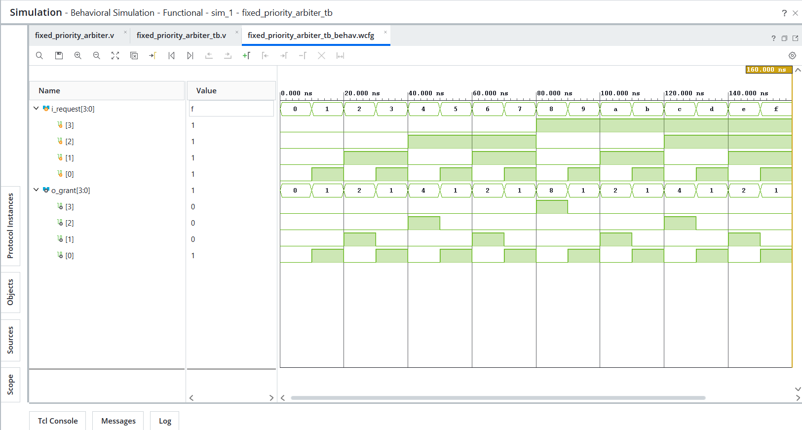
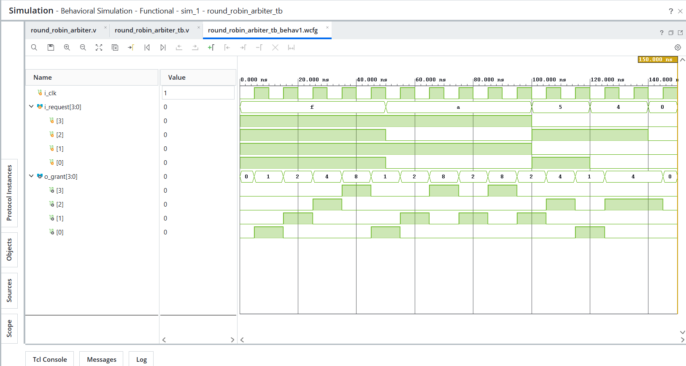

# Day 21 - Arbiter

## Overview

This project implements arbiter designs in Verilog HDL.

Arbiters are digital circuits used to manage access to a shared resource when multiple requesters attempt to use it simultaneously. They ensure that only one requester receives access at a time and are commonly used in bus systems, memory controllers, DMA controllers, and multi-master communication systems.

---

## Implemented Modules

### 1. Fixed Priority Arbiter

- Supports four request inputs
- Assigns a fixed priority to each requester
- Grants access to only one requester at a time
- Simple and fast arbitration logic

Priority Order:

```text
Request 0 > Request 1 > Request 2 > Request 3
```

Example:

```text
Request = 1011

R3 R2 R1 R0
 1  0  1  1

Grant = 0001
```

Requester 0 receives the grant because it has the highest priority.

---

### 2. Round Robin Arbiter

- Supports four request inputs
- Rotates priority after every successful grant
- Prevents starvation
- Provides fair access to all requesters

Priority Rotation:

```text
R0 → R1 → R2 → R3 → R0 ...
```

Example:

```text
Request = 1111
```

Grant Sequence:

```text
0001
0010
0100
1000
0001
...
```

Each requester gets an opportunity to access the shared resource.

---

## Files Included

```text
fixed_priority_arbiter.v
round_robin_arbiter.v

fixed_priority_arbiter_tb.v
round_robin_arbiter_tb.v

fixed_priority_arbiter_waveform.png
round_robin_arbiter_waveform.png

README.md
```

---

## Waveforms

### Fixed Priority Arbiter



### Round Robin Arbiter

