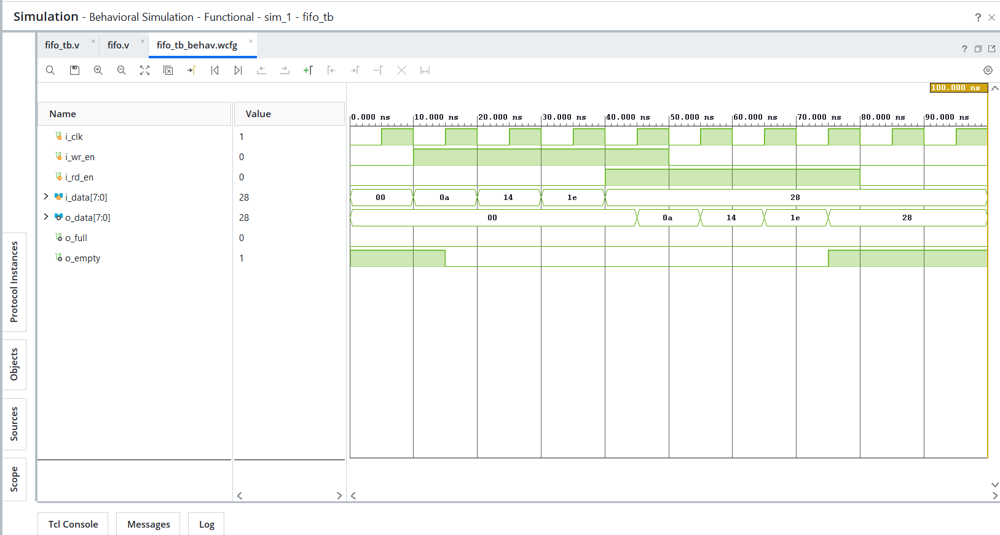

# Day 22 - FIFO

## Overview

This project implements a Synchronous FIFO (First In First Out) in Verilog HDL.

A FIFO is a memory structure that stores data in the order it is received. The first data written into the FIFO is the first data read out. FIFOs are commonly used in communication systems, processors, buffering applications, and data transfer interfaces.

---

## Implemented Module

### 1. Synchronous FIFO

Features:

- 4-depth FIFO memory
- 8-bit data width
- Single clock operation
- Write pointer
- Read pointer
- Full flag generation
- Empty flag generation
- Simultaneous read and write support

FIFO operations:

```text
Write Only   -> FIFO occupancy increases
Read Only    -> FIFO occupancy decreases
Read + Write -> FIFO occupancy remains unchanged
```

---

## FIFO Architecture

Components used:

```text
Memory Array
Write Pointer (wr_ptr)
Read Pointer (rd_ptr)
Count Register
Full Flag
Empty Flag
```

Data flow:

```text
Write Data
    |
    v
+-----------+
|   FIFO    |
+-----------+
    |
    v
Read Data
```

---

## Example Operation

Write sequence:

```text
10
20
30
40
```

FIFO contents:

```text
10 -> 20 -> 30 -> 40
```

Read sequence:

```text
10
20
30
40
```

Since FIFO follows the First-In First-Out principle, data is read in the same order it was written.

---

## Files Included

```text
fifo.v

fifo_tb.v

fifo_waveform.png

README.md
```

---

## Waveforms

### FIFO

