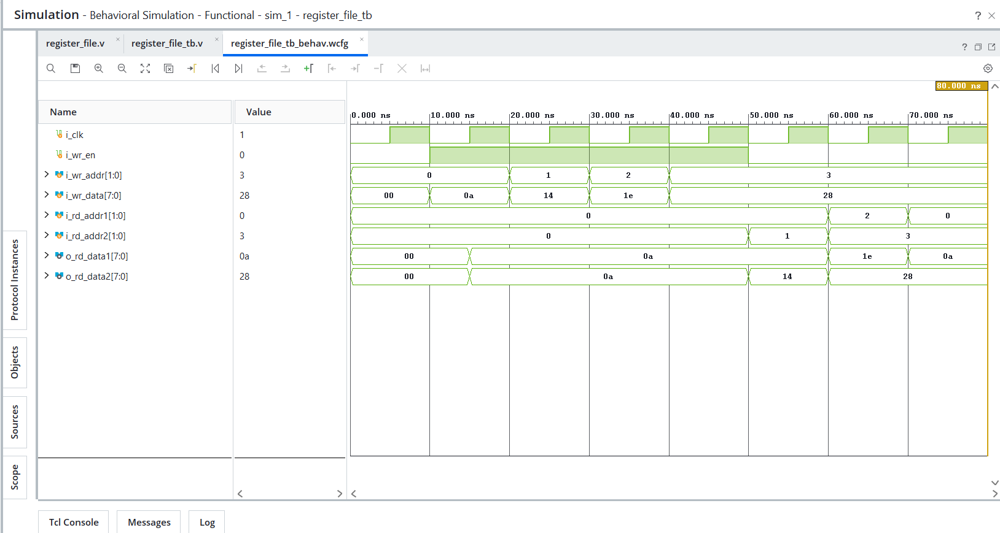

# Day 23 - Register File

## Overview

This project implements a 4x8 Register File in Verilog HDL.

A Register File is a collection of registers used for temporary data storage in digital systems and processors. It provides fast access to data through read and write operations and is a fundamental component of CPU architectures such as RISC-V, ARM, and MIPS.

---

## Implemented Module

### 1. Register File

Features:

- 4 Registers
- 8-bit Data Width
- 1 Write Port
- 2 Read Ports
- Synchronous Write Operation
- Asynchronous Read Operation

Register Structure:

```text
R0 : 8-bit
R1 : 8-bit
R2 : 8-bit
R3 : 8-bit
```

---

## Operations

### Write Operation

Data is written into the selected register on the positive edge of the clock when write enable is asserted.

Example:

```text
Write 10 → R0
Write 20 → R1
Write 30 → R2
Write 40 → R3
```

Register Contents:

```text
R0 = 10
R1 = 20
R2 = 30
R3 = 40
```

---

### Read Operation

Two registers can be read simultaneously using two independent read ports.

Examples:

```text
Read R0 and R1
Output = 10, 20

Read R2 and R3
Output = 30, 40

Read R0 and R3
Output = 10, 40
```

---

## Architecture

```text
                  +------------------+
                  |  Register File   |
                  |                  |
Write Address --->|                  |
Write Data ------>|                  |
Write Enable ---->|                  |
                  |                  |
Read Address 1 -->|                  |--> Read Data 1
Read Address 2 -->|                  |--> Read Data 2
                  +------------------+
```

---

## Files Included

```text
register_file.v

register_file_tb.v

register_file_waveform.png

README.md
```

---

## Waveforms

### Register File

The waveform verifies:

- Write operation
- Read operation
- Dual read ports
- Synchronous write
- Asynchronous read

