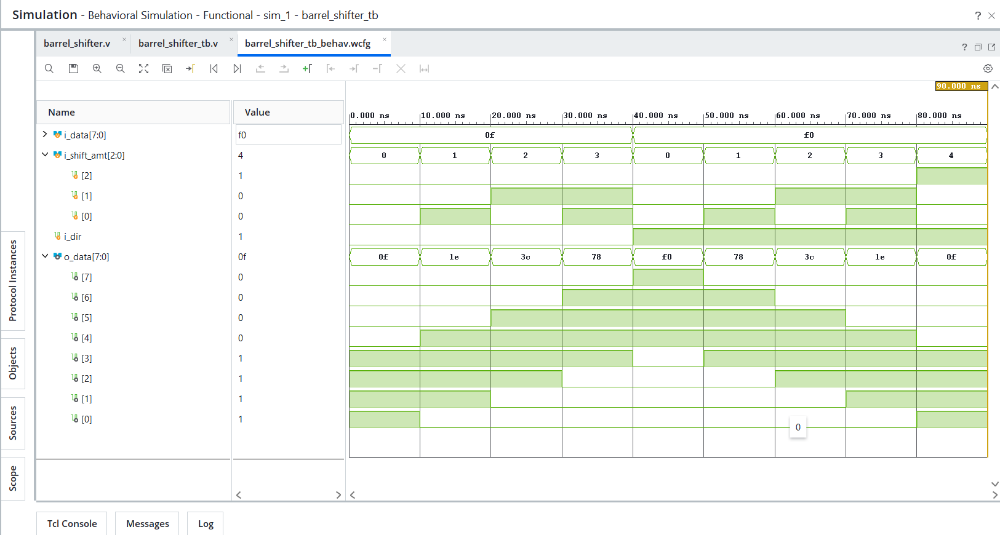

# Day 24 - Barrel Shifter

## Overview

This project implements an 8-bit Barrel Shifter in Verilog HDL.

A Barrel Shifter is a combinational circuit that shifts data by a specified number of bit positions in a single operation. Barrel shifters are widely used in processors, ALUs, DSPs, and digital systems for efficient bit manipulation.

---

## Implemented Module

### 1. Barrel Shifter

Features:

- 8-bit Data Input
- 8-bit Data Output
- Logical Left Shift
- Logical Right Shift
- 3-bit Shift Amount Input
- Combinational Design

---

## Inputs and Outputs

### Inputs

```text
i_data      [7:0]  - Input Data
i_shift_amt [2:0]  - Shift Amount
i_dir              - Shift Direction
```

### Output

```text
o_data [7:0]       - Shifted Data
```

---

## Shift Direction Control

```text
i_dir = 0 → Left Shift
i_dir = 1 → Right Shift
```

---

## Operations

### Left Shift

Example:

```text
Input      = 00001111
Shift Amt  = 2

Output     = 00111100
```

---

### Right Shift

Example:

```text
Input      = 11110000
Shift Amt  = 3

Output     = 00011110
```

---

## Architecture

```text
                 +------------------+
                 |                  |
Input Data ----->|                  |
                 |  Barrel Shifter  |-----> Shifted Output
Shift Amount --->|                  |
                 |                  |
Direction ------>|                  |
                 +------------------+
```

---

## Test Cases Verified

### Left Shift

```text
Input = 00001111

Shift 0 → 00001111
Shift 1 → 00011110
Shift 2 → 00111100
Shift 3 → 01111000
```

---

### Right Shift

```text
Input = 11110000

Shift 0 → 11110000
Shift 1 → 01111000
Shift 2 → 00111100
Shift 3 → 00011110
Shift 4 → 00001111
```

---

## Files Included

```text
barrel_shifter.v

barrel_shifter_tb.v

barrel_shifter_waveform.png

README.md
```

---

## Waveforms

### Barrel Shifter

The waveform verifies:

- Logical Left Shift
- Logical Right Shift
- Multiple Shift Amounts
- Combinational Operation

