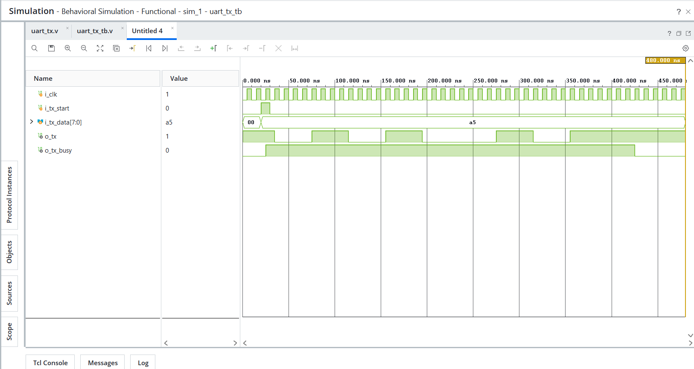

# Day 25 - UART Transmitter

## Overview

This project implements a UART (Universal Asynchronous Receiver Transmitter) Transmitter in Verilog HDL.

UART is a serial communication protocol widely used in microcontrollers, FPGAs, processors, embedded systems, and communication interfaces. The transmitter converts parallel data into a serial bit stream for transmission.

---

## Implemented Module

### 1. UART Transmitter

Features:

- Baud Rate Generator
- FSM-Based Design
- Start Bit Generation
- 8-bit Data Transmission
- Stop Bit Generation
- Busy Flag Indication
- LSB First Transmission

---

## Inputs and Outputs

### Inputs

```text
i_clk
```

System Clock

```text
i_tx_start
```

Transmission Start Signal

```text
i_tx_data [7:0]
```

8-bit Data to be Transmitted

---

### Outputs

```text
o_tx
```

Serial Transmit Line

```text
o_tx_busy
```

Indicates Ongoing Transmission

---

## UART Frame Format

The UART transmitter sends data using the following frame structure:

```text
+-----------+----------+-----------+
| Start Bit | 8 Data   | Stop Bit  |
|     0     | D0 - D7  |     1     |
+-----------+----------+-----------+
```

---

## Data Transmission Order

UART transmits the Least Significant Bit (LSB) first.

Example:

```text
Input Data = 8'hA5

A5 = 10100101
```

Transmission Sequence:

```text
Start Bit = 0

D0 = 1
D1 = 0
D2 = 1
D3 = 0
D4 = 0
D5 = 1
D6 = 0
D7 = 1

Stop Bit = 1
```

---

## FSM Architecture

The UART transmitter uses four states:

```text
          +------+
          | IDLE |
          +------+
              |
              v
         +---------+
         | START   |
         +---------+
              |
              v
         +---------+
         | DATA    |
         +---------+
              |
              v
         +---------+
         | STOP    |
         +---------+
              |
              v
          +------+
          | IDLE |
          +------+
```

---

## Baud Generator

A baud generator is used to control the transmission speed.

Formula:

```text
BAUD_DIV = Clock Frequency / Baud Rate
```

Example:

```text
Clock Frequency = 50 MHz
Baud Rate       = 9600

BAUD_DIV = 50,000,000 / 9,600
         = 5208
```

For simulation purposes:

```text
BAUD_DIV = 4
```

is used to simplify waveform observation.

---

## Test Case Verified

### Input Data

```text
8'hA5
```

### Expected UART Frame

```text
Idle  = 1

Start = 0

1
0
1
0
0
1
0
1

Stop  = 1
```

---

## Applications

- FPGA Communication Interfaces
- Embedded Systems
- Microcontrollers
- Processor Debugging
- Serial Communication Systems
- UART-Based Peripherals

---

## Files Included

```text
uart_tx.v

uart_tx_tb.v

uart_tx_waveform.png

README.md
```

---

## Waveforms

### UART Transmitter

