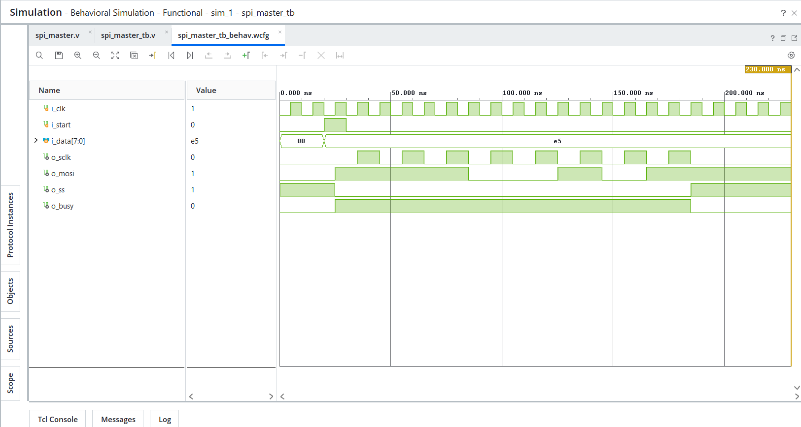

# Day 27 - SPI Master

## Overview

This project implements an SPI (Serial Peripheral Interface) Master in Verilog HDL.

SPI is a synchronous serial communication protocol widely used for communication between processors, microcontrollers, FPGAs, sensors, ADCs, DACs, EEPROMs, and Flash memories.

---

## Implemented Module

### 1. SPI Master

Features:

- 8-bit data transmission
- SPI Clock (SCLK) generation
- MOSI data transmission
- Slave Select (SS) control
- Busy signal generation
- MSB First transmission
- FSM-based operation

SPI operations:

```text
Idle State      -> Wait for Start Signal
Transfer State  -> Send Serial Data
Complete State  -> Return to Idle
```

---

## SPI Architecture

Components used:

```text
Shift Register
Bit Counter
SPI Clock Generator
Slave Select Logic
Busy Signal Logic
```

Data flow:

```text
Parallel Data
      |
      v
+---------------+
|  SPI Master   |
+---------------+
      |
      v
     MOSI
```

---

## SPI Signals

```text
SCLK  -> Serial Clock
MOSI  -> Master Out Slave In
SS    -> Slave Select
```

---

## Example Operation

Input Data:

```text
E5 = 11100101
```

SPI uses MSB First transmission:

```text
Bit7 = 1
Bit6 = 1
Bit5 = 1
Bit4 = 0
Bit3 = 0
Bit2 = 1
Bit1 = 0
Bit0 = 1
```

Transmitted sequence:

```text
1
1
1
0
0
1
0
1
```

During transmission:

```text
SS   = 0
BUSY = 1
```

After transmission:

```text
SS   = 1
BUSY = 0
```

---

## Files Included

```text
spi_master.v

spi_master_tb.v

spi_master_waveform.png

README.md
```

---

## Waveforms

