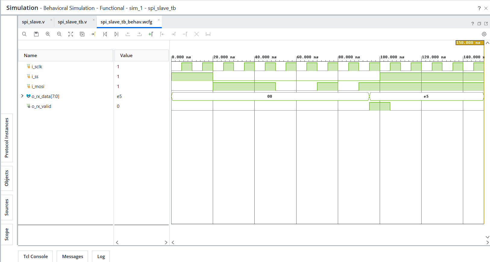

# Day 28 - SPI Slave

## Overview

This project implements an SPI (Serial Peripheral Interface) Slave in Verilog HDL.

SPI is a synchronous serial communication protocol widely used for communication between processors, microcontrollers, FPGAs, sensors, ADCs, DACs, EEPROMs, and Flash memories.

The SPI Slave receives serial data from the SPI Master through the MOSI line using the clock generated by the master.

---

## Implemented Module

### 1. SPI Slave

Features:

- 8-bit data reception
- MOSI data sampling
- Slave Select (SS) support
- SPI Clock (SCLK) driven operation
- Data valid signal generation
- MSB First reception
- Shift register based design

SPI operations:

```text
SS = 1 -> Slave Disabled
SS = 0 -> Slave Enabled

Receive Serial Data
Generate Valid Signal
Store Received Data
```

---

## SPI Architecture

Components used:

```text
Shift Register
Bit Counter
Data Register
Valid Signal Logic
```

Data flow:

```text
MOSI
  |
  v
+--------------+
|  SPI Slave   |
+--------------+
  |
  v
Received Data
```

---

## SPI Signals

```text
SCLK  -> Serial Clock
MOSI  -> Master Out Slave In
SS    -> Slave Select
```

---

## Example Operation

Input Data:

```text
E5 = 11100101
```

SPI receives data MSB First:

```text
Bit7 = 1
Bit6 = 1
Bit5 = 1
Bit4 = 0
Bit3 = 0
Bit2 = 1
Bit1 = 0
Bit0 = 1
```

Received sequence:

```text
1
1
1
0
0
1
0
1
```

After reception:

```text
o_rx_data  = E5
o_rx_valid = 1
```

---

## Files Included

```text
spi_slave.v

spi_slave_tb.v

spi_slave_waveform.png

README.md
```

---

## Waveforms

