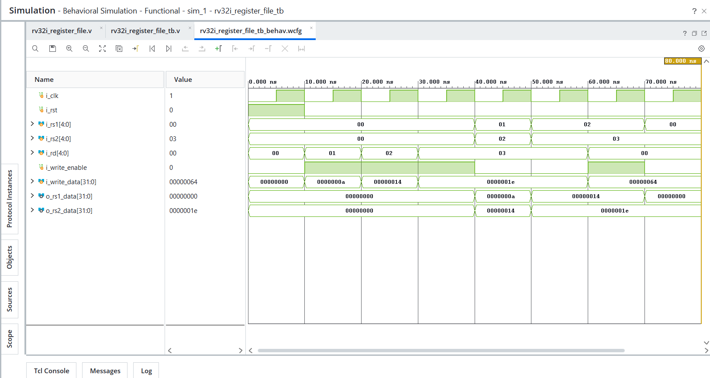

# Day 29 - RV32I Register File

## Overview

This project implements a 32 x 32-bit RV32I Register File in Verilog HDL.

The Register File is one of the most important blocks in a RISC-V processor. It stores operands and results used by instructions during execution.

---

## Implemented Module

### 1. RV32I Register File

Features:

- 32 Registers
- 32-bit Data Width
- Two Read Ports
- One Write Port
- Synchronous Write
- Asynchronous Read
- x0 Hardwired to Zero
- RV32I Compatible

Register File operations:

```text
Write Data into Register
Read Data from Register
Prevent Writes to x0
Always Return 0 for x0
```

---

## Register Organization

Registers:

```text
x0
x1
x2
...
x31
```

Special Register:

```text
x0 = 0
```

The x0 register is hardwired to zero and cannot be modified.

Example:

```text
Write x0 = 100
```

Result:

```text
x0 = 0
```

---

## Register File Architecture

Components used:

```text
32 x 32-bit Register Array
Write Logic
Read Port 1
Read Port 2
x0 Protection Logic
```

Data flow:

```text
                 +------------------+
rs1 -----------> |                  |
rs2 -----------> |  Register File   | ----> rs1_data
                 |                  | ----> rs2_data
write_data ----> |                  |
rd ------------> |                  |
write_enable --> |                  |
                 +------------------+
```

---

## Read and Write Operations

### Synchronous Write

Write operation occurs on:

```text
Positive Edge of Clock
```

Example:

```text
x1 = 10
x2 = 20
x3 = 30
```

---

### Asynchronous Read

Read operation does not require a clock edge.

Example:

```text
rs1 = x1
rs2 = x3
```

Output:

```text
rs1_data = 10
rs2_data = 30
```

---

## Example Operation

Write:

```text
x1 = 10
x2 = 20
x3 = 30
```

Read:

```text
rs1 = x1
rs2 = x2
```

Output:

```text
rs1_data = 10
rs2_data = 20
```

Read:

```text
rs1 = x2
rs2 = x3
```

Output:

```text
rs1_data = 20
rs2_data = 30
```

Attempt:

```text
x0 = 100
```

Result:

```text
x0 = 0
```

---

## Files Included

```text
rv32i_register_file.v

rv32i_register_file_tb.v

rv32i_register_file_waveform.png

README.md
```

---

## Waveforms

