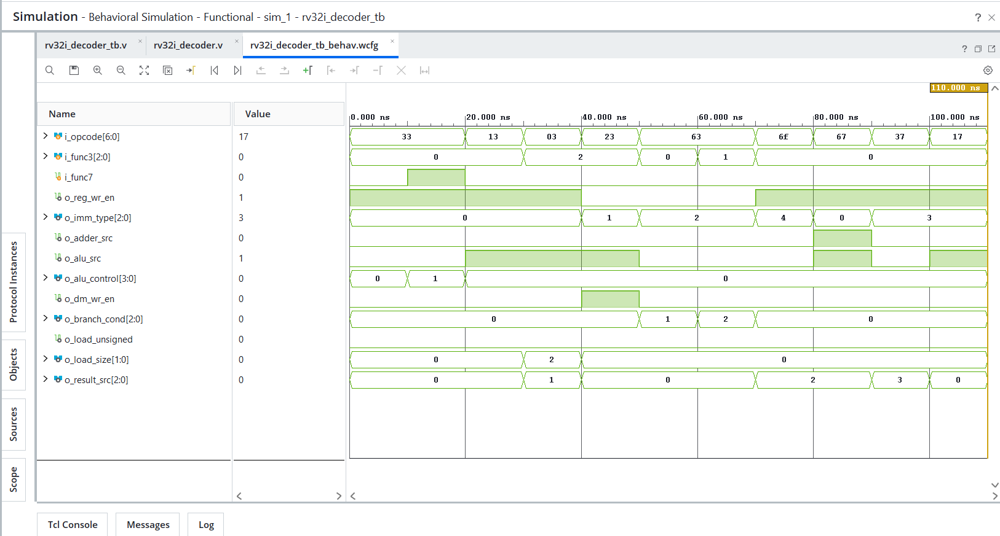

# Day 30 - RV32I Decoder

## Overview

This project implements an RV32I Instruction Decoder in Verilog HDL.

The Decoder is a key component of a RISC-V processor. It examines the instruction opcode and function fields and generates the control signals required by the datapath.

---

## Implemented Module

### 1. RV32I Decoder

Features:

- RV32I Compatible
- Opcode Decoding
- ALU Control Generation
- Immediate Type Selection
- Branch Condition Generation
- Load/Store Control
- Register Write Control
- Result Source Selection
- JAL / JALR Support
- LUI / AUIPC Support

Decoder operations:

```text
Instruction Fetch
        |
        v
Opcode Decode
        |
        v
Generate Control Signals
```

---

## Supported Instruction Types

### R-Type

Examples:

```text
ADD
SUB
AND
OR
XOR
SLL
SRL
SRA
SLT
SLTU
```

Opcode:

```text
0110011
```

---

### I-Type ALU

Examples:

```text
ADDI
ANDI
ORI
XORI
SLLI
SRLI
SRAI
SLTI
SLTIU
```

Opcode:

```text
0010011
```

---

### Load Instructions

Examples:

```text
LB
LH
LW
LBU
LHU
```

Opcode:

```text
0000011
```

---

### Store Instructions

Examples:

```text
SB
SH
SW
```

Opcode:

```text
0100011
```

---

### Branch Instructions

Examples:

```text
BEQ
BNE
BLT
BGE
BLTU
BGEU
```

Opcode:

```text
1100011
```

---

### Jump Instructions

Examples:

```text
JAL
JALR
```

Opcodes:

```text
1101111
1100111
```

---

### Upper Immediate Instructions

Examples:

```text
LUI
AUIPC
```

Opcodes:

```text
0110111
0010111
```

---

## Decoder Architecture

Components used:

```text
Opcode Decoder
Function Decoder
ALU Control Generator
Immediate Type Generator
Branch Control Logic
Result Source Selector
```

Data flow:

```text
              Instruction
                    |
                    v
          +------------------+
          |  RV32I Decoder   |
          +------------------+
                    |
                    v

    Register Control Signals
    ALU Control Signals
    Memory Control Signals
    Branch Control Signals
```

---

## Generated Control Signals

```text
reg_wr_en
imm_type
adder_src
alu_src
alu_control
dm_wr_en
branch_cond
load_unsigned
load_size
result_src
```

---

## Example Operation

### ADD

Input:

```text
Opcode = 0110011
Func3  = 000
Func7  = 0
```

Output:

```text
Reg Write Enable = 1
ALU Control      = ADD
Result Source    = ALU
```

---

### SUB

Input:

```text
Opcode = 0110011
Func3  = 000
Func7  = 1
```

Output:

```text
Reg Write Enable = 1
ALU Control      = SUB
```

---

### LW

Input:

```text
Opcode = 0000011
Func3  = 010
```

Output:

```text
Load Size   = Word
Result Src  = Memory
Reg Write   = Enabled
```

---

### SW

Input:

```text
Opcode = 0100011
```

Output:

```text
Memory Write Enable = 1
Immediate Type      = S-Type
```

---

### BEQ

Input:

```text
Opcode = 1100011
Func3  = 000
```

Output:

```text
Branch Condition = BEQ
```

---

### JAL

Input:

```text
Opcode = 1101111
```

Output:

```text
Register Write = Enabled
Immediate Type = J-Type
Result Source  = PC + 4
```

---

## Files Included

```text
rv32i_decoder.v

rv32i_decoder_tb.v

rv32i_decoder_waveform.png

README.md
```

---

## Waveforms



---

## 30-Day RTL Design Challenge Completed

Projects Completed:

```text
Day 01 - Logic Gates
Day 02 - Multiplexers
Day 03 - Encoder / Decoder
Day 04 - Comparators
Day 05 - Adders
Day 06 - Subtractors
Day 07 - ALU
Day 08 - Latches and Flip-Flops
Day 09 - Registers
Day 10 - Shift Registers
Day 11 - Counters
Day 12 - Mod Counters
Day 13 - Ring and Johnson Counter
Day 14 - Clock Divider
Day 15 - Sequence Detector
Day 16 - Traffic Light Controller
Day 17 - Debouncer
Day 18 - Edge Detector
Day 19 - Pulse Generator
Day 20 - Synchronizer
Day 21 - Arbiter
Day 22 - FIFO
Day 23 - Register File
Day 24 - Barrel Shifter
Day 25 - UART TX
Day 26 - UART RX
Day 27 - SPI Master
Day 28 - SPI Slave
Day 29 - RV32I Register File
Day 30 - RV32I Decoder
```

**30-Day RTL Design Challenge Successfully Completed**